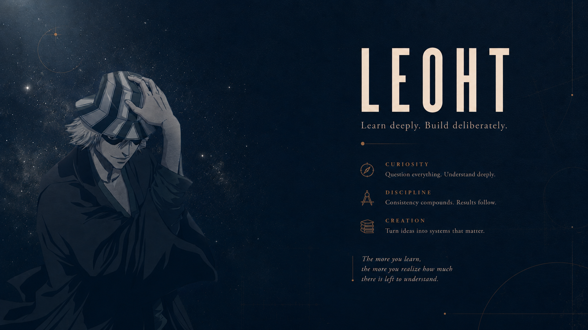

  

<h1 align="center">Leoht</h1>

  <i>LEE-oht • /ˈliː.ɒt/</i>

  Building systems from first principles. 
  Sometimes computers agree.

   •
   •
   •
   •
  

---

## About

I'm interested in understanding systems from first principles.

Whether it's proving a theorem, optimizing a kernel, designing distributed infrastructure, or reading ML papers for fun *(questionable life choices)*, I'm usually asking one question.

> **Why does this work?**

---

## Technical Focus

| Field | Focus | Progress |
|:------|:------|:--------:|
| Core Computer Science | Algorithms • Systems • Software Engineering • Theory | █████████░ |
| Mathematics | Pure • Applied • Computational | ████████░░ |
| Artificial Intelligence | Machine Learning • Deep Learning • Intelligent Systems | ████████░░ |
| ML Systems | Training • Inference • Optimization • Scalability | ████████░░ |
| Robotics | Perception • Planning • Autonomy | ███████░░░ |
| Physics | Classical • Modern • Computational | ██████░░░░ |
| Electronics | Digital Systems • Embedded Computing • Hardware | █████░░░░░ |
| Research | Scientific Computing • Experimental Design | ███████░░░ |

---

> *"There are only two hard things in Computer Science: cache invalidation, naming things, and off-by-one errors."*

---

## FAQ

| Question | Answer |
|----------|--------|
| **What are you building?** | Hopefully a future. |
| **Favorite programming language?** | The one that just compiled. |
| **Why so many interests?** | Curiosity scales better than boredom. |

---

## Competitive Programming

| Platform | Profile |
|----------|---------|
| Codeforces | [leoht](https://codeforces.com/profile/leoht) |
| LeetCode | [eigen_leoht](https://leetcode.com/u/eigen_leoht/) |
| CodeChef | [eigen_leoht](https://www.codechef.com/users/eigen_leoht) |
| AtCoder | [leoht](https://atcoder.jp/users/leoht) |

---

*"Still learning."*

